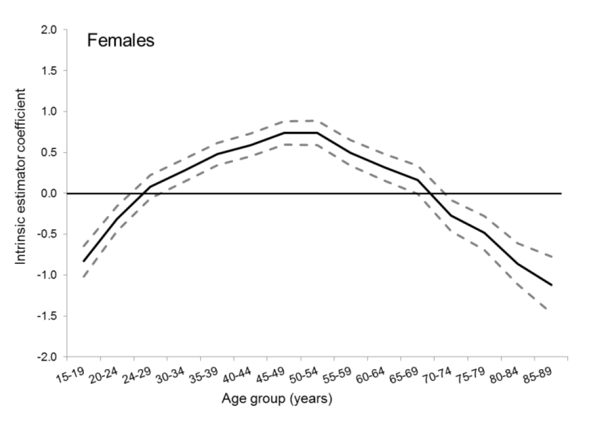
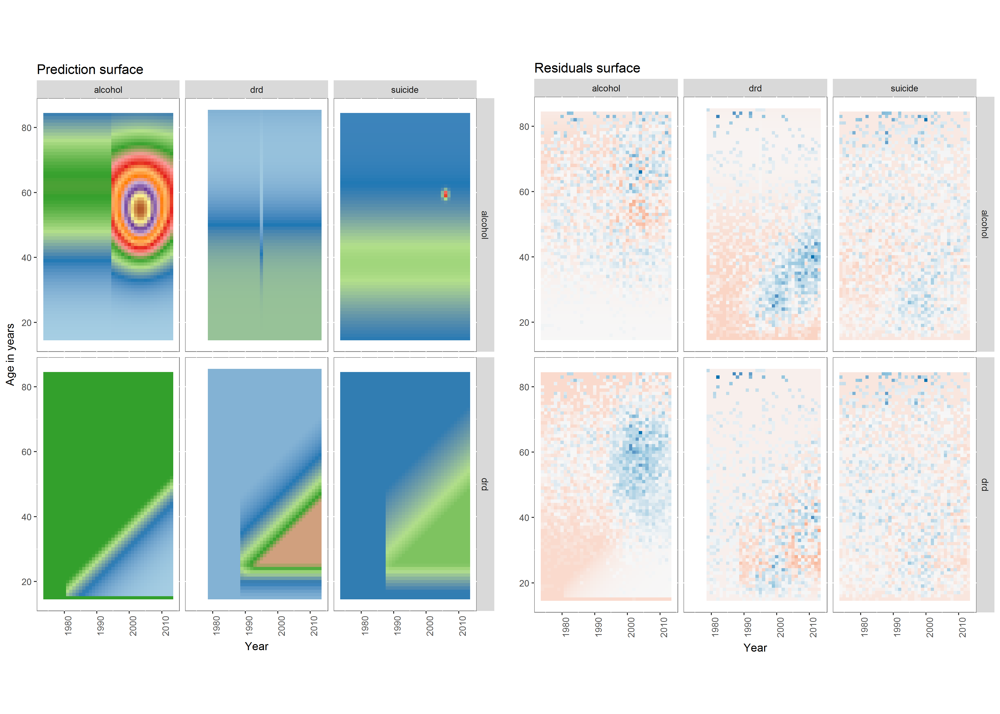

```{r setup, include=FALSE}
knitr::opts_chunk$set(echo = FALSE)
```

## Thanks/Acknowledgements

- Anne Owen, Nik Lomax, LIDA 
- Janet Boutell, Jim Lewsey, University of Glasgow
- Gerry McCartney, Jane Parkinson, NHS Health Scotland


## Key ideas 

- Informal models precede formal models
- Learning statistical modelling involves learning to say something in a rareified language
- But before trying to say something you must have something to say 
- Standard linear modelling approaches encourage a 'variable-based' way of thinking about the world in which effects are assumed to be independent and partitionable
- **Lexis surface**:  a way of looking at population data which encourages a 'case-based' way of thinking about what the data show, in which the independent/partitionable effect assumption is not 'baked in'
- Starting with the Lexis surface allows better informal models to be developed before the statistical modelling stage

## Some additional ideas

- Quantitative research isn't about numbers, it's about patterns
- Demography (**demos**: the people; **-graphy**: describing) is the grandmother of the social sciences
- People are good at images but bad at numbers
- People are good at complex **gestalts**; bad at linear sequence
- The Lexis Surface (**maps of age-time**) allows data to be explored much as maps of space can be explored

## Structure of talk

- Gestalt examples
- Defining a data visualisation
- Example 1: All-cause mortality data 
- Example 2: Despair-related deaths in Scotland
- Concluding remarks

# Introduction 

## Examples of Gestalts

```{r out.width="700px", echo = F}
knitr::include_graphics("presentation images/gestalt.PNG")

```

Source: https://www.slideshare.net/jnicotra/gestalt-theory-for-visual-design 


## Case-based reasoning as Gestalts 

```{r out.height="300px", echo = F}
knitr::include_graphics("presentation images/Image 27.jpg")


```

- Source: http://www.cardiffhipandknee.com/hip/hip-revisions
- Source: http://emgn.com/entertainment/22-shockingly-graphic-x-rays-where-the-patient-somehow-survived/


## Grammar of Graphics 101

Data visualisations

- Not all graphics are data visualisations
- Data visualisations require a consistent application of **mapping rules**

Mapping rules:

- Variable in data $->$ graphical feature
- Can be specified formally using the [Grammer of Graphics](http://ggplot2.tidyverse.org/)

## Examples of variables in data 

- Age
- Year
- Gender
- Death rate
- Crime rate
- Fertility rate
- Health scores
- Political Attitudes

etc

## Examples of Graphical features

- Position across horizontal axis
- Position across vertical axis
- Colour of marks
- Size of dot/width of line
- Transparency
- whether lines are solid or dashed
- Colour in filled areas between marks 
- Angle 

etc 

## Example

This set of mapping rules...

| Variable in Dataset | Graphical Feature | 
| --------------------| ----------------- |
| % of population providing free care | Position along vertical axis|
| % of population with health needs | Position along horizontal axis | 
| Size of population in areal unit | Size of circle | 
| Whether in North or south of England | Colour of bubble | 
<br>
Applied to 2001 English/Welsh Census data...


## Example

...Produces the following

```{r out.height="350px", echo = F}
knitr::include_graphics("presentation images/dorling_shaw.PNG")


```

Source: https://www.ncbi.nlm.nih.gov/pmc/articles/PMC1326106/

## Population data 

Population data are data where:

- <span style = "color:purple">**Something**</span>
- Has been recorded consistently about <span style = "color:green">**types of people**</span>
- For different <span style = "color:red">**ages**</span> 
- and at different <span style = "color:blue">**times**</span> 

# Example 1: All-cause mortality 

## Example of data in this format 

From the [Human Mortality Database](http://www.mortality.org/)  

```{r load_tidyverse ,echo=FALSE, comment = FALSE, message = FALSE, warning = FALSE}
require(tidyverse)
```

```{r load_hmd, echo=FALSE, comment = FALSE, message = FALSE, cache = TRUE, warning = FALSE}

dta <- read_csv("data/mortality/counts.csv")

```

```{r show_hmd_header, message = FALSE, comment = FALSE, warning = FALSE}
dta

```

## Decoding this 

- <span style = "color:green">country</span> and <span style = "color:green">sex</span> are grouping variables (i.e. categorical not cardinal)
- <span style = "color:blue">year</span> and <span style = "color:red">age</span> are continuous variables
- <span style = "color:purple">death_count</span> and <span style = "color:purple">population_count</span> are attributes that are specific to different combinations of <span style = "color:green">country</span>, <span style = "color:green">sex</span>, <span style = "color:blue">year</span>, and <span style = "color:red">age</span>.

*1.4 million rows!*

## Standard ways of exploring 

- Sweeping by <span style = "color:blue">year</span>: Life expectancies, crude mortality rates 
- Sweeping by <span style = "color:red">age</span>: 'Bathtub curves'
- Conditional sweeping by <span style = "color:blue">year</span>: different <span style = "color:red">age groups</span> 
- etc 


## Infant mortality  

```{r show_scot_infmort, echo = FALSE, warning = FALSE, comment = FALSE}
dta %>% 
  filter(sex == "total") %>% 
  filter(age == 0) %>% 
  mutate(death_rate = 1000 * death_count / population_count) %>% 
  ggplot(aes(x = year,  y = death_rate, group = country)) + 
    geom_line() + 
    geom_line(
      aes(x = year, y = death_rate),
      colour = "blue", size = 1.2,
      inherit.aes = FALSE, 
      data = . %>% filter(country == "GBR_SCO")
    ) +
  labs(x = "Year", y = "Infant death rate per thousand births")


```

## Infant mortality  

```{r show_scot_infmort_log, echo = FALSE, warning = FALSE, comment = FALSE}
dta %>% 
  filter(sex == "total") %>% 
  filter(age == 0) %>% 
  mutate(death_rate = 1000 * death_count / population_count) %>% 
  ggplot(aes(x = year,  y = death_rate, group = country)) + 
    geom_line() + 
    geom_line(
      aes(x = year, y = death_rate),
      colour = "blue", size = 1.2,
      inherit.aes = FALSE, 
      data = . %>% filter(country == "GBR_SCO")
    ) +
  labs(x = "Year", y = "Infant death rate per thousand births") + 
  scale_y_log10()


```

## Other ages 

```{r show_scot_otherage_log, echo = FALSE, warning = FALSE, comment = FALSE}
dta %>% 
  filter(sex == "total") %>% 
  filter(age %in% seq(20, 80, by = 20)) %>% 
  mutate(death_rate = 1000 * death_count / population_count) %>% 
  ggplot(aes(x = year,  y = death_rate, group = country)) + 
    geom_line() + 
    geom_line(
      aes(x = year, y = death_rate),
      colour = "blue", size = 1.2,
      inherit.aes = FALSE, 
      data = . %>% filter(country == "GBR_SCO")
    ) +
  labs(x = "Year", y = "Death rate per thousand population") + 
  scale_y_log10() + 
  facet_wrap(~age)


```

## Relationship with age 

```{r scot_bathtub_recent, echo = FALSE, comment = FALSE, warning = FALSE}

dta %>% 
  filter(sex == "total") %>% 
  filter(country == "GBR_SCO") %>% 
  filter(year == 2010) %>% 
  mutate(death_rate = 1000 * death_count / population_count) %>% 
  ggplot(aes(x = age, y = death_rate)) + 
  geom_line() + 
  scale_y_log10() + 
  labs(x = "Age", y = "Death rate per 1000", title = "Mortality by age in Scotland in 2010")

```

## Bathtub, Scotland, all years

```{r scot_bathtub_allyears, echo = FALSE, comment = FALSE, warning = FALSE}

dta %>% 
  filter(sex == "total") %>% 
  filter(country == "GBR_SCO") %>% 
  mutate(years_since_max = max(year) - year) %>% 
  filter(age <= 90) %>% 
  mutate(death_rate = 1000 * death_count / population_count) %>% 
  ggplot(aes(x = age, y = death_rate, colour = year, group = year)) + 
  geom_line() + 
  scale_y_log10() + 
  scale_colour_distiller(type = "qual") + 
  labs(x = "Age", y = "Death rate per 1000", title = "Mortality by age in Scotland in all available years")

```

## Bathtub, Scotland, all years, by gender

```{r scot_bathtub_allyears_bygender, echo = FALSE, comment = FALSE, warning = FALSE}

dta %>% 
  filter(sex != "total") %>% 
  filter(country == "GBR_SCO") %>% 
  filter(age <= 90) %>% 
  mutate(death_rate = 1000 * death_count / population_count) %>% 
  ggplot(aes(x = age, y = death_rate, colour = year, group = year)) + 
  geom_line() + 
  scale_y_log10() + 
  scale_colour_distiller(type = "qual") + 
  facet_wrap(~sex) + 
  labs(x = "Age", y = "Death rate per 1000", title = "Mortality by age in Scotland in all available years") 
```

## A variable-based approach (most quantitative research)

- Simple linear regression: Regress one variable on one variable
- Multiple linear regression: Regress one variable on multiple variables
- Assume independence between explanatory variables 
- (Usually) assess statistical significance of regression coefficients
    - ["The sizeless stare"](https://www.amazon.co.uk/Cult-Statistical-Significance-Economics-Cognition/dp/0472050079)
    - Conflates statistical with substantive significance
    
## An example {.smaller}


```{r regress_inf_mort_01, echo = FALSE}
dta %>% 
  filter(age == 0) %>% 
  filter(sex != "total") %>% 
  mutate(death_rate = death_count / population_count) %>% 
  lm(log(death_rate) ~ sex , data = .) -> mod_00

mod_00 %>% summary()

```

## An example {.smaller}


```{r regress_inf_mort_02, echo = FALSE}
dta %>% 
  filter(age == 0) %>% 
  filter(sex != "total") %>% 
  mutate(death_rate = death_count / population_count) %>%
  mutate(years_since_first = year - min(year)) %>% 
  lm(log(death_rate) ~ sex + years_since_first, data = .) -> mod_01

mod_01 %>% summary()

```

## An example {.smaller}


```{r regress_inf_mort_03, echo = FALSE}
dta %>% 
  filter(age == 0) %>% 
  filter(sex != "total") %>% 
  mutate(death_rate = death_count / population_count) %>%
  mutate(years_since_first = year - min(year)) %>% 
  lm(log(death_rate) ~ sex + poly(years_since_first, 2), data = .) -> mod_02 
mod_02 %>% summary()

```

## An example {.smaller}


```{r regress_inf_mort_04, echo = FALSE}
dta %>% 
  filter(age == 0) %>% 
  filter(sex != "total") %>% 
  mutate(death_rate = death_count / population_count) %>%
  mutate(years_since_first = year - min(year)) %>% 
  lm(log(death_rate) ~ sex + poly(years_since_first, 3), data = .) -> mod_03

mod_03 %>% summary()

```

## An example {.smaller}

```{r regress_inf_mort_05, echo = FALSE}
dta %>% 
  filter(age == 0) %>% 
  filter(sex != "total") %>% 
  mutate(death_rate = death_count / population_count) %>%
  mutate(years_since_first = year - min(year)) %>% 
  lm(log(death_rate) ~ sex * poly(years_since_first, 2), data = .) -> mod_04 

mod_04 %>% summary()

```

## An example {.smaller}

```{r regress_inf_mort_06, echo = FALSE}
dta %>% 
  filter(age == 0) %>% 
  filter(sex != "total") %>% 
  mutate(death_rate = death_count / population_count) %>%
  mutate(years_since_first = year - min(year)) %>% 
  mutate(is_scotland = country == "GBR_SCO") %>% 
  lm(log(death_rate) ~ sex + is_scotland +  poly(years_since_first, 2), data = .) -> mod_05

mod_05 %>% summary()

```


## An example {.smaller}

```{r compare_models, echo = FALSE}
anova(mod_00, mod_01, mod_02, mod_03, mod_04, mod_05)
```

## A case-based approach 

- **Embrace inherent complexity**
- Interactions between factors norm not the exception?
- Imagine tens of thousands of values not as hived off into distinct variables (age, year)...
- But forming a complex *surface* of values over age-time

**How?** *By representing the surface on a map*

## Mapping a spatial map

| Data Variable | Aesthetic | 
| ----------------- | ---------- |
| Latitude      | Horizontal position |
| Longitude     | Vertical position   | 
| Elevation     | Colour/shade/contour lines | 

## Mapping an age-time map (Lexis surface)

| Data Variable | Aesthetic | 
| ------------- | --------- |
| Year      | Horizontal position |
| Age     | Vertical position   | 
| Mortality rate     | Colour/shade/contour lines | 

## Lexis surface for Scotland 


```{r scot_lexis_tidied, echo = FALSE, comment = FALSE, warning = FALSE}

dta %>% 
  filter(sex == "total") %>% 
  filter(country == "GBR_SCO") %>% 
  filter(age <= 90) %>% 
  mutate(death_rate = 1000 * death_count / population_count) %>% 
  ggplot(aes(x = year, y = age, fill = death_rate)) + 
  geom_tile() + 
  coord_fixed() + 
  xlim(c(1850, 2015)) + 
  scale_fill_gradientn(
    "Death rate\n/1000",
    colours = scales::brewer_pal(palette = "Paired")(12), 
    trans = "log", 
    breaks = c(0.2, 0.5, 1, 2, 5, 10, 20, 50, 100, 200)
    )  +
  geom_abline(slope = 1, intercept = seq(-2010, -1750, by = 10), linetype = "dashed", alpha = 0.5) + 
  theme_minimal() + 
  geom_vline(xintercept = seq(1850, 2010, by = 10), linetype = "dashed", alpha = 0.5) + 
  geom_hline(yintercept = seq(0, 90, by = 10), linetype = "dashed", alpha = 0.5) + 
  labs(
    x = "Year", 
    y = "Age in single years", 
    title = "Mortality, Overall, Scotland",
    caption = "Source: Human Mortality Database") + 
  scale_y_continuous(sec.axis = sec_axis(~ 2010 - ., name = "Birth Cohort")) +
  theme(axis.text.y.right = element_text(angle = 45, hjust = -1.5))
```

# Example 2: Cause specific mortality in Scotland

## NHS Health Scotland Example 

- Three causes of death: 
    - Drug related
    - Alcohol
    - Suicide
- Two deprivation groups (Carstairs)
    - Most deprived fifth of areas 
    - Less deprived four fifths of areas
- Two genders
    - Males
    - Females
    
## A variable-based approach

- [Intrinsic Estimator](http://yangclaireyang.web.unc.edu/files/2013/07/Yang_etal_AJS.pdf) (IE)
- Partition into Age, Period and Cohort (APC) Effects. Slices data at:
    - Age effects: 0 degrees
    - Cohort effects: 45 degrees
    - Period effects: 90 degrees
- Identifiability problem: Impossible to do in theory (models 'underspecified')
- Constraints applied 

## Results from IE: Alcohol-related Age effects

```{r out.width="96%", echo = F}


```

## Results from IE: Alcohol-related Period effects


```{r out.width="96%", echo = F}


```


## Results from IE: Alcohol-related Cohort effects

```{r out.width="96%", echo = F}


```

## Results from IE: Drug-related Age effects

```{r out.width="48%", echo = F}



```


## Results from IE: Drug-related Period effects

```{r out.width="48%", echo = F}


```


## Results from IE: Drug-related Cohort effects

```{r out.width="48%", echo = F}


```


## Lexis surfaces for males in most deprived areas

```{r out.width = "60%", fig.align='center', echo = F}


```

## A typology of reasoning 

| Mode    | Informal | Formal |
| ------- | -------- | ------ |
| Geometric | (1) Informal<br>Geometric | (2) Formal<br>Geometric | 
| Aetiologic | (3) Informal<br>Aetiologic | (4) Formal<br>Aetiologic | 

<br>

* Focus here is on (1), (2), and (3). Not (4)


## What do the surfaces show, geometrically? 

- Alcohol-related: 
    - Curve with age, peaking around age 60, then falling
    - 'Hotspot' in 2000s
- Drug-related:
    - 'Truncated triangle'
    - Ageing in effect (increased risk from around 18-25)
    - Cohort-demarcated change 
    - Period effect (early 1990s)
- Suicide:
    - 'Noisier' version of drug-related
    

    
## Developing and comparing models 

```{r out.width = "96%", echo = F}


```


## Findings

- The model based on the geometric 'reading' of the Lexis surface for the Alcohol data fits the Alcohol data better than DRD or Suicide data
- The model based on the geometric 'reading' of the DRD/Suicide Lexis surfaces fit these data better than the Alcohol data 
- Both models fit the data they are based on better than most naive, over-flexible  models (not shown) designed to curve to many shapes
- Unlike some naive, over-flexible models, the parameters in the bespoke models have some meaningful interpretations

## Table of 'truncated triangle' model parameters 

| Parameter  | Drug-related | Suicide | Alcohol |  
| -----------| ------------ | ------- | ------- |  
| First year of effect | 1988 | 1987  | 1980    | 
| First age affected   | 15   | 17    | 15      |
| Peak age             | 25   | 25    | 9       |
| First cohort affected| 1942 | 1938  | 1961    |
| Peak cohort          | 1968 | 1964  | 1997    |
| Fit                  | Good | Good  | Bad     |


## Suggestion: A Lexis surface 'workflow'

```{r out.width = "96%", echo = F}


```

# Summary/Conclusion

## Final thoughts

- Before struggling to say something, you should have something to say
- Your thoughts about population processes should not be limited by what you can easily express in a statistical model. (i.e. don't worry about formalisation too early)
- Think in structures, not slices
- For making decisions, informal aetiology, guided by informal geometry, may be sufficient

## Example of decisions that could be informed by above observations

- Observation: DRD/suicide patterns closely linked
- Observation: Both disproportionately affect males in deprived areas 
    - Approx 10-fold higher hazard than females in less deprived areas 
- Observation: Both disproportionately affect cohorts born in 1960s ('Trainspotter Generation')
- Decision: Link mental health services to drug support services?
- Decision: Ensure services best located to serve those in greatest need
- Decision: Explore further why male hazards ~ 3x higher than female hazards in same area
    - Qual research in gender:area interactions and experience
    - Explore how services can be adapted to more effectively engage males at high risk of suicide/DRD
- Decision: Actively target high risk demographics?

## And finally:

- Thanks for listening! 


