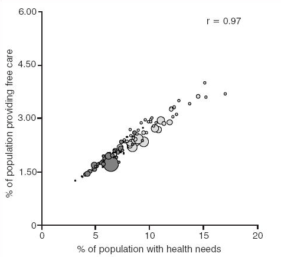

## Welcome!

About your instructor: Jon Minton. My background

- Undergrad: Engineering
- Taught postgrad: Critical Theory/Cultural Studies
- PhD: Quant Sociology & Human Geography (Welfare Reform)
- Postgrad: Housing Policy (Interviewing)
- Then: Systematic Reviewing (Health Sciences: NICE)
- Then: Health Economics (Health Sciences: NICE)
- Then: Urban Studies

## My perspective

- Accidental Demography
- Quant / (Some) Qual (a bit)
- Physical Sciences / Social Sciences / Humanities
- Health / Sociological 

## Core aim

To promote the following ideas:

- Much of the quant/qual divide is really case-based vs. variable-based
- Quantitative research isn't about numbers, it's about patterns
- Demography (**demos**: the people; **-graphy**: describing) is the grandmother of the social sciences
- People are good at images but bad at numbers
- People are good at complex **gestalts**; bad at linear sequence
- The Lexis Surface (**maps of age-time**) allows data to be explored much as maps of space can be explored

## Examples of Gestalts

```{r out.width="700px", echo = F}


```

Source: https://www.slideshare.net/jnicotra/gestalt-theory-for-visual-design 

## Case-based reasoning as Gestalts 


- Source: http://crossislandmedicalcenter.com/x-rays/

## Case-based reasoning as Gestalts 

```{r out.height="300px", echo = F}
knitr::include_graphics("presentation images/Image 27.jpg")
knitr::include_graphics("presentation images/EMGN822.jpg")

```

- Source: http://www.cardiffhipandknee.com/hip/hip-revisions
- Source: http://emgn.com/entertainment/22-shockingly-graphic-x-rays-where-the-patient-somehow-survived/

## Maps as Gestalts 

```{r out.height="400px", echo = F}
knitr::include_graphics("presentation images/satellite-view-of-earth-at-night-750.jpg")


```


- Source: https://geology.com/articles/satellite-photo-earth-at-night.shtml


## Map of place; map of age-time

```{r out.height="400px", echo = F}


```


- Source: https://ije-blog.com/2016/06/27/lexis-cubes-1-from-maps-of-space-to-maps-of-time/comment-page-1/


## Maps and Mapping 

Data visualisations

- Not all graphics are data visualisations
- Data visualisations require a consistent application of **mapping rules**

Mapping rules:

- Variable in data $->$ graphical feature
- Can be specified formally using the [Grammer of Graphics](http://ggplot2.tidyverse.org/)

## Examples of variables in data 

- Age
- Year
- Gender
- Death rate
- Crime rate
- Fertility rate
- Health scores
- Political Attitudes

etc

## Examples of Graphical features

- Position across horizontal axis
- Position across vertical axis
- Colour of marks
- Size of dot/width of line
- Transparency
- whether lines are solid or dashed
- Colour in filled areas between marks 
- Angle 

etc 

## Example

This set of mapping rules...

| Variable in Dataset | Graphical Feature | 
| --------------------| ----------------- |
| % of population providing free care | Position along vertical axis|
| % of population with health needs | Position along horizontal axis | 
| Size of population in areal unit | Size of circle | 
| Whether in North or south of England | Colour of bubble | 

Applied to 2001 English/Welsh Census data...


## Example

...Produces the following

```{r out.height="350px", echo = F}



```

Source: https://www.ncbi.nlm.nih.gov/pmc/articles/PMC1326106/

## Population data 

Population data are data where:

- <span style = "color:purple">**Something**</span>
- Has been recorded consistently about <span style = "color:green">**types of people**</span>
- For different <span style = "color:red">**ages**</span> 
- and at different <span style = "color:blue">**times**</span> 

## Example of data in this format 

From the [Human Mortality Database](http://www.mortality.org/)  

```{r load_tidyverse ,echo=FALSE, comment = FALSE, message = FALSE, warning = FALSE}
require(tidyverse)
```

```{r load_hmd, echo=FALSE, comment = FALSE, message = FALSE, cache = TRUE, warning = FALSE}

dta <- read_csv("data/mortality/counts.csv")

```

```{r show_hmd_header, message = FALSE, comment = FALSE, warning = FALSE}
dta

```

## Decoding this 

- <span style = "color:green">country</span> and <span style = "color:green">sex</span> are grouping variables (i.e. categorical not cardinal)
- <span style = "color:blue">year</span> and <span style = "color:red">age</span> are continuous variables
- <span style = "color:purple">death_count</span> and <span style = "color:purple">population_count</span> are attributes that are specific to different combinations of <span style = "color:green">country</span>, <span style = "color:green">sex</span>, <span style = "color:blue">year</span>, and <span style = "color:red">age</span>.

*1.4 million rows!*

## Standard ways of exploring 

- Sweeping by <span style = "color:blue">year</span>: Life expectancies, crude mortality rates 
- Sweeping by <span style = "color:red">age</span>: 'Bathtub curves'
- Conditional sweeping by <span style = "color:blue">year</span>: different <span style = "color:red">age groups</span> 
- etc 

## Example: Scotland, population size 


```{r pop_size, echo = FALSE, comment = FALSE, warning = FALSE}
dta %>% 
  filter(country == "GBR_SCO") %>% 
  filter(sex == "total") %>% 
  group_by(year) %>% 
  summarise(pop_total = sum(population_count)) %>%
  ungroup() %>% 
  mutate(pop_total = pop_total / 1000000) %>% 
  ggplot(aes(x = year, y = pop_total)) + 
  geom_line() + 
  labs(x = "Year", y = "Population (millions)", title = "Population of Scotland over time") +
  ylim(c(0, 6))


```

## Example: Scotland, population size 


```{r pop_size_sex, echo = FALSE, comment = FALSE, warning = FALSE}
dta %>% 
  filter(country == "GBR_SCO") %>% 
  filter(sex != "total") %>% 
  group_by(year, sex) %>% 
  summarise(pop_total = sum(population_count)) %>%
  ungroup() %>% 
  mutate(pop_total = pop_total / 1000000) %>% 
  ggplot(aes(x = year, y = pop_total, group = sex, colour = sex)) + 
  geom_line() + 
  labs(x = "Year", y = "Population (millions)", title = "Population of Scotland over time") +
  ylim(c(0, 3))

```

## But this quickly becomes overwhelming


```{r pop_size_all, echo = FALSE, comment = FALSE, warning = FALSE}
dta %>% 
  filter(sex == "total") %>% 
  group_by(year, country) %>% 
  summarise(pop_total = sum(population_count)) %>%
  ungroup() %>% 
  mutate(pop_total = pop_total / 1000000) %>% 
  ggplot(aes(x = year, y = pop_total, group = country)) + 
  geom_line() + 
  labs(x = "Year", y = "Population (millions)", title = "Population of 39 countries over time") +
  ylim(c(0, 300)) + 
  geom_line(aes(x = year, y = pop_total), colour = "blue", size = 1.2, 
            data = dta %>% 
              filter(country == "GBR_SCO") %>% 
              filter(sex == "total") %>% 
              group_by(year) %>% 
              summarise(pop_total = sum(population_count)) %>%
              ungroup() %>% 
              mutate(pop_total = pop_total / 1000000),
            inherit.aes = FALSE
              )

```

## Life expectancies 

```{r show_scot_e0, echo = FALSE, warning = FALSE, comment = FALSE}
dta %>% 
  filter(sex == "total") %>% 
  mutate(popdeath = population_count * age) %>% 
  group_by(country, year) %>% 
    summarise(e0 = sum(popdeath) / sum(population_count)) %>% 
  ungroup() %>% 
  ggplot(aes(x = year,  y = e0, group = country)) + 
    geom_line() + 
    geom_line(
      aes(x = year, y = e0),
      colour = "blue", size = 1.2,
      inherit.aes = FALSE, 
      data = . %>% filter(country == "GBR_SCO")
    )


```


## Infant mortality  

```{r show_scot_infmort, echo = FALSE, warning = FALSE, comment = FALSE}
dta %>% 
  filter(sex == "total") %>% 
  filter(age == 0) %>% 
  mutate(death_rate = 1000 * death_count / population_count) %>% 
  ggplot(aes(x = year,  y = death_rate, group = country)) + 
    geom_line() + 
    geom_line(
      aes(x = year, y = death_rate),
      colour = "blue", size = 1.2,
      inherit.aes = FALSE, 
      data = . %>% filter(country == "GBR_SCO")
    ) +
  labs(x = "Year", y = "Infant death rate per thousand births")


```

## Infant mortality  

```{r show_scot_infmort_log, echo = FALSE, warning = FALSE, comment = FALSE}
dta %>% 
  filter(sex == "total") %>% 
  filter(age == 0) %>% 
  mutate(death_rate = 1000 * death_count / population_count) %>% 
  ggplot(aes(x = year,  y = death_rate, group = country)) + 
    geom_line() + 
    geom_line(
      aes(x = year, y = death_rate),
      colour = "blue", size = 1.2,
      inherit.aes = FALSE, 
      data = . %>% filter(country == "GBR_SCO")
    ) +
  labs(x = "Year", y = "Infant death rate per thousand births") + 
  scale_y_log10()


```

## Other ages 

```{r show_scot_otherage_log, echo = FALSE, warning = FALSE, comment = FALSE}
dta %>% 
  filter(sex == "total") %>% 
  filter(age %in% seq(20, 80, by = 20)) %>% 
  mutate(death_rate = 1000 * death_count / population_count) %>% 
  ggplot(aes(x = year,  y = death_rate, group = country)) + 
    geom_line() + 
    geom_line(
      aes(x = year, y = death_rate),
      colour = "blue", size = 1.2,
      inherit.aes = FALSE, 
      data = . %>% filter(country == "GBR_SCO")
    ) +
  labs(x = "Year", y = "Death rate per thousand population") + 
  scale_y_log10() + 
  facet_wrap(~age)


```

## Relationship with age 

```{r scot_bathtub_recent, echo = FALSE, comment = FALSE, warning = FALSE}

dta %>% 
  filter(sex == "total") %>% 
  filter(country == "GBR_SCO") %>% 
  filter(year == 2010) %>% 
  mutate(death_rate = 1000 * death_count / population_count) %>% 
  ggplot(aes(x = age, y = death_rate)) + 
  geom_line() + 
  scale_y_log10() + 
  labs(x = "Age", y = "Death rate per 1000", title = "Mortality by age in Scotland in 2010")

```

## Bathtub, Scotland, all years

```{r scot_bathtub_allyears, echo = FALSE, comment = FALSE, warning = FALSE}

dta %>% 
  filter(sex == "total") %>% 
  filter(country == "GBR_SCO") %>% 
  mutate(years_since_max = max(year) - year) %>% 
  filter(age <= 90) %>% 
  mutate(death_rate = 1000 * death_count / population_count) %>% 
  ggplot(aes(x = age, y = death_rate, colour = year, group = year)) + 
  geom_line() + 
  scale_y_log10() + 
  scale_colour_distiller(type = "qual") + 
  labs(x = "Age", y = "Death rate per 1000", title = "Mortality by age in Scotland in all available years")

```

## Bathtub, Scotland, all years, by gender

```{r scot_bathtub_allyears_bygender, echo = FALSE, comment = FALSE, warning = FALSE}

dta %>% 
  filter(sex != "total") %>% 
  filter(country == "GBR_SCO") %>% 
  filter(age <= 90) %>% 
  mutate(death_rate = 1000 * death_count / population_count) %>% 
  ggplot(aes(x = age, y = death_rate, colour = year, group = year)) + 
  geom_line() + 
  scale_y_log10() + 
  scale_colour_distiller(type = "qual") + 
  facet_wrap(~sex) + 
  labs(x = "Age", y = "Death rate per 1000", title = "Mortality by age in Scotland in all available years") 
```

## A variable-based approach (most quantitative research)

- Simple linear regression: Regress one variable on one variable
- Multiple linear regression: Regress one variable on multiple variables
- Assume independence between explanatory variables 
- (Usually) assess statistical significance of regression coefficients
    - ["The sizeless stare"](https://www.amazon.co.uk/Cult-Statistical-Significance-Economics-Cognition/dp/0472050079)
    - Conflates statistical with substantive significance
    
## An example {.smaller}


```{r regress_inf_mort_01, echo = FALSE}
dta %>% 
  filter(age == 0) %>% 
  filter(sex != "total") %>% 
  mutate(death_rate = death_count / population_count) %>% 
  lm(log(death_rate) ~ sex , data = .) -> mod_00

mod_00 %>% summary()

```

## An example {.smaller}


```{r regress_inf_mort_02, echo = FALSE}
dta %>% 
  filter(age == 0) %>% 
  filter(sex != "total") %>% 
  mutate(death_rate = death_count / population_count) %>%
  mutate(years_since_first = year - min(year)) %>% 
  lm(log(death_rate) ~ sex + years_since_first, data = .) -> mod_01

mod_01 %>% summary()

```

## An example {.smaller}


```{r regress_inf_mort_03, echo = FALSE}
dta %>% 
  filter(age == 0) %>% 
  filter(sex != "total") %>% 
  mutate(death_rate = death_count / population_count) %>%
  mutate(years_since_first = year - min(year)) %>% 
  lm(log(death_rate) ~ sex + poly(years_since_first, 2), data = .) -> mod_02 
mod_02 %>% summary()

```

## An example {.smaller}


```{r regress_inf_mort_04, echo = FALSE}
dta %>% 
  filter(age == 0) %>% 
  filter(sex != "total") %>% 
  mutate(death_rate = death_count / population_count) %>%
  mutate(years_since_first = year - min(year)) %>% 
  lm(log(death_rate) ~ sex + poly(years_since_first, 3), data = .) -> mod_03

mod_03 %>% summary()

```

## An example {.smaller}

```{r regress_inf_mort_05, echo = FALSE}
dta %>% 
  filter(age == 0) %>% 
  filter(sex != "total") %>% 
  mutate(death_rate = death_count / population_count) %>%
  mutate(years_since_first = year - min(year)) %>% 
  lm(log(death_rate) ~ sex * poly(years_since_first, 2), data = .) -> mod_04 

mod_04 %>% summary()

```

## An example {.smaller}

```{r regress_inf_mort_06, echo = FALSE}
dta %>% 
  filter(age == 0) %>% 
  filter(sex != "total") %>% 
  mutate(death_rate = death_count / population_count) %>%
  mutate(years_since_first = year - min(year)) %>% 
  mutate(is_scotland = country == "GBR_SCO") %>% 
  lm(log(death_rate) ~ sex + is_scotland +  poly(years_since_first, 2), data = .) -> mod_05

mod_05 %>% summary()

```


## An example {.smaller}

```{r compare_models, echo = FALSE}
anova(mod_00, mod_01, mod_02, mod_03, mod_04, mod_05)
```

## A case-based approach (focus of this workshop)

- **Embrace inherent complexity**
- Interactions between factors norm not the exception?
- Imagine tens of thousands of values not as hived off into distinct variables (age, year)...
- But forming a complex *surface* of values over age-time

**How?** *By representing the surface on a map*

## Mapping a spatial map

| Data Variable | Aesthetic | 
| ----------------- | ---------- |
| Latitude      | Horizontal position |
| Longitude     | Vertical position   | 
| Elevation     | Colour/shade/contour lines | 

## Mapping an age-time map (Lexis surface)

| Data Variable | Aesthetic | 
| ------------- | --------- |
| Year      | Horizontal position |
| Age     | Vertical position   | 
| Mortality rate     | Colour/shade/contour lines | 

## Lexis surface for Scotland 

```{r scot_lexis_overall, echo = FALSE, comment = FALSE, warning = FALSE}

dta %>% 
  filter(sex == "total") %>% 
  filter(country == "GBR_SCO") %>% 
  filter(age <= 90) %>% 
  mutate(death_rate = 1000 * death_count / population_count) %>% 
  ggplot(aes(x = year, y = age, fill = death_rate)) + 
  geom_tile() + 
  scale_fill_gradientn("Death rate\n/1000",colours = scales::brewer_pal(palette = "Paired")(12), trans = "log", breaks = c(0.2, 0.5, 1, 2, 5, 10, 20, 50, 100, 200))  
```

## Lexis surface for Scotland 

```{r scot_lexis_bygender, echo = FALSE, comment = FALSE, warning = FALSE}

dta %>% 
  filter(sex != "total") %>% 
  filter(country == "GBR_SCO") %>% 
  filter(age <= 90) %>% 
  mutate(death_rate = 1000 * death_count / population_count) %>% 
  ggplot(aes(x = year, y = age, fill = death_rate)) + 
  geom_tile() + 
  facet_wrap(~sex) +
  scale_fill_gradientn("Death rate\n/1000",colours = scales::brewer_pal(palette = "Paired")(12), trans = "log", breaks = c(0.2, 0.5, 1, 2, 5, 10, 20, 50, 100, 200))  
```

## Additional modifications


```{r scot_lexis_tidied, echo = FALSE, comment = FALSE, warning = FALSE}

dta %>% 
  filter(sex == "total") %>% 
  filter(country == "GBR_SCO") %>% 
  filter(age <= 90) %>% 
  mutate(death_rate = 1000 * death_count / population_count) %>% 
  ggplot(aes(x = year, y = age, fill = death_rate)) + 
  geom_tile() + 
  coord_fixed() + 
  xlim(c(1850, 2015)) + 
  scale_fill_gradientn(
    "Death rate\n/1000",
    colours = scales::brewer_pal(palette = "Paired")(12), 
    trans = "log", 
    breaks = c(0.2, 0.5, 1, 2, 5, 10, 20, 50, 100, 200)
    )  +
  geom_abline(slope = 1, intercept = seq(-2010, -1750, by = 10), linetype = "dashed", alpha = 0.5) + 
  theme_minimal() + 
  geom_vline(xintercept = seq(1850, 2010, by = 10), linetype = "dashed", alpha = 0.5) + 
  geom_hline(yintercept = seq(0, 90, by = 10), linetype = "dashed", alpha = 0.5) + 
  labs(
    x = "Year", 
    y = "Age in single years", 
    title = "Mortality, Overall, Scotland",
    caption = "Source: Human Mortality Database") + 
  scale_y_continuous(sec.axis = sec_axis(~ 2010 - ., name = "Birth Cohort")) +
  theme(axis.text.y.right = element_text(angle = 45, hjust = -1.5))
```

## By gender 

```{r scot_lexis_tidied_bygender, echo = FALSE, comment = FALSE, warning = FALSE}

dta %>% 
  filter(sex != "total") %>% 
  filter(country == "GBR_SCO") %>% 
  filter(age <= 90) %>% 
  mutate(death_rate = 1000 * death_count / population_count) %>% 
  ggplot(aes(x = year, y = age, fill = death_rate)) + 
  geom_tile() + 
  coord_fixed() + 
  xlim(c(1850, 2015)) + 
  scale_fill_gradientn(
    "Death rate\n/1000",
    colours = scales::brewer_pal(palette = "Paired")(12), 
    trans = "log", 
    breaks = c(0.2, 0.5, 1, 2, 5, 10, 20, 50, 100, 200)
    )  +
  geom_abline(slope = 1, intercept = seq(-2010, -1750, by = 10), linetype = "dashed", alpha = 0.5) + 
  theme_minimal() + 
  facet_wrap(~sex) + 
  geom_vline(xintercept = seq(1850, 2010, by = 10), linetype = "dashed", alpha = 0.5) + 
  geom_hline(yintercept = seq(0, 90, by = 10), linetype = "dashed", alpha = 0.5) + 
  labs(
    x = "Year", 
    y = "Age in single years", 
    title = "Mortality, Overall, Scotland",
    caption = "Source: Human Mortality Database") 
```

## Aim of morning session

- Explore country/gender-specific Lexis surfaces
- Identify, discuss and interpret features in cases
    - Common to many cases
    - Specific to one or two cases 
- Produce group presentations on chosen case(s)
- Present! 

## Bonus!

Two additional applications 

1. Comparative Mortality in Scotland
2. Cause-specific mortality in the USA 


